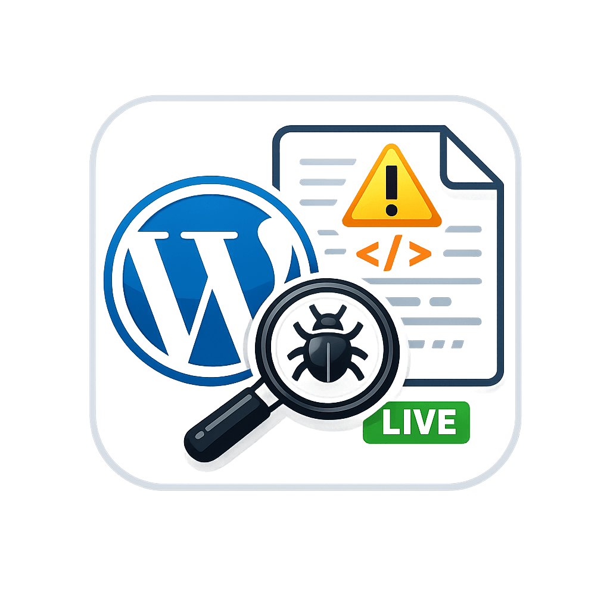

<p align="center">
  
</p>

<h1 align="center">WP Debug Stream</h1>

<p align="center">
  <strong>Live WordPress Debug Log Viewer for VS Code</strong><br>
  Automatically enables debugging, detects WordPress root, and streams <code>debug.log</code> in real-time.
</p>

<p align="center">
  Built with ❤️ by <strong>Aditya Dubey</strong>
</p>

---

## 🚀 Overview

**WP Debug Stream** is a lightweight and powerful VS Code extension designed specifically for **WordPress plugin and theme developers**.

It eliminates the repetitive task of:

- Opening `wp-config.php`
- Finding the `debug.log` path
- Manually navigating to `wp-content/debug.log`
- Refreshing the file after every error

Instead, it provides:

✅ Automatic WordPress root detection  
✅ Auto configuration of `WP_DEBUG` and `WP_DEBUG_LOG`  
✅ Real-time streaming (like `tail -f`)  
✅ Auto-scroll to latest error  
✅ Works even when developing from plugin folder only

---

## 🎯 Why This Extension?

When developing WordPress plugins or themes, debugging often requires constantly switching between files and refreshing logs.

This extension solves real developer pain by:

- Detecting `wp-config.php` automatically (even from `wp-content/plugins/your-plugin`)
- Asking permission before modifying config
- Creating `debug.log` if it doesn't exist
- Streaming logs without reload flicker
- Saving time during development

No more manual log hunting.

---

## 🛠 Features

### 🔍 Smart WordPress Root Detection

Works whether you open:

- Entire WordPress installation
- `wp-content` folder
- `plugins` folder
- Individual plugin folder

### ⚙ Automatic Debug Setup

If debug logging is not enabled, the extension:

- Prompts for permission
- Safely inserts:
  ```php
  define('WP_DEBUG', true);
  define('WP_DEBUG_LOG', true);
  define('WP_DEBUG_DISPLAY', false);
  ```

### 📡 Real-Time Log Streaming

Streams `wp-content/debug.log` live:

- No full file reload
- No flickering
- Smooth append
- Auto-scroll to bottom

### 🧹 Lightweight & Fast

- No external dependencies
- Minimal footprint
- Built purely with VS Code API + Node.js

---

## 📦 Installation

### From VS Code Marketplace

1. Open Extensions (`Ctrl + Shift + X`)
2. Search for **WP Debug Stream**
3. Click Install

### Manual Installation (.vsix)

```bash
code --install-extension wp-debug-stream-0.0.1.vsix
```

---

## 🚀 Usage

1. Open your WordPress project (or plugin folder)
2. Open Command Palette:

```
Ctrl + Shift + P
```

3. Run:

```
WP: Open Debug Log
```

That’s it 🎉

The extension will:

- Detect WordPress root
- Enable debug logging (with permission)
- Open `debug.log`
- Start live streaming

---

## 🧠 Perfect For

- WordPress Plugin Developers
- WordPress Theme Developers
- WooCommerce Developers
- PHP Developers working with WordPress
- Gutenberg Block Developers
- React + WordPress developers

---

## 🔐 Safe Configuration

The extension:

- Never modifies files without permission
- Inserts debug settings before:

  ```
  /* That's all, stop editing! Happy publishing. */
  ```

- Keeps your configuration clean

---

## 💡 Example Workflow Improvement

Before:

1. Trigger error
2. Open wp-config.php
3. Copy log path
4. Navigate to debug.log
5. Refresh file
6. Repeat

After:

1. Trigger error
2. Watch log update instantly 🚀

---

## 📈 SEO Keywords

WordPress debug log viewer
VS Code WordPress extension
WordPress plugin debugging tool
Live WordPress log viewer
WordPress debug.log tail
WordPress development tools
PHP debugging for WordPress
WooCommerce debugging extension

---

## 👨‍💻 Author

**Aditya Dubey**
GitHub: [https://github.com/cyberadityacode](https://github.com/cyberadityacode)

If you find this extension useful, consider giving it a ⭐ on GitHub.

---

## 📜 License

MIT License

---

## 🤝 Contributions

Pull requests, feature ideas, and improvements are welcome.

## ❤️ Support

If this extension improves your WordPress development workflow, please share it with other developers.

Happy Coding 🚀
